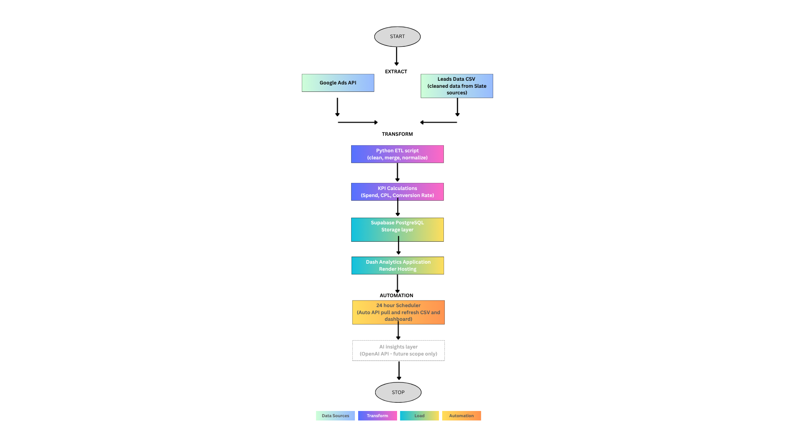

# Marketing Analytics ETL Pipeline & Dash Dashboard

## Project Overview

This project demonstrates an end-to-end marketing analytics solution that automates campaign data extraction, transformation, storage, and visualization.

The system extracts Google Ads performance data, applies data quality and transformation logic using Python, loads processed data into a PostgreSQL database hosted on Supabase, and presents business insights through an interactive Dash analytics application.

The dashboard enables users to monitor marketing performance, evaluate lead generation efficiency, and analyze Cost Per Lead (CPL) across academic programs.

---

## Live Dashboard

Available at:

https://marketing-etl-dashboard.onrender.com

---

## Architecture



## Technology Stack

* Python
* Pandas
* SQLAlchemy
* Google Ads API
* Supabase PostgreSQL
* Dash
* Plotly
* Flask
* Render

---

## ETL Workflow

### Extract

* Pull campaign performance data from Google Ads API
* Read lead conversion datasets from source files
* Read historical spend datasets

### Transform

* Normalize campaign naming conventions
* Standardize program mappings
* Calculate reporting periods and fiscal year logic
* Aggregate marketing performance metrics
* Calculate Cost Per Lead (CPL)

### Data Quality Validation

* Required column validation
* Null value validation
* Duplicate detection
* Data type validation
* Referential integrity checks
* Spend validation checks

### Load

* Incremental loading of lead records
* Upsert logic for campaign spend data
* Load dimension tables
* Store analytics-ready datasets in PostgreSQL

---

## Database Schema

### Fact Tables

#### leads

* lead_id
* submission_date
* reporting_year
* reporting_month
* program
* normalized_program
* source

#### campaign_spend

* campaign_spend_id
* campaign_name
* reporting_year
* reporting_month
* normalized_program
* source
* spend

### Dimension Tables

#### program_dim

Stores standardized program names.

#### source_dim

Stores marketing acquisition sources.

---

## Dashboard Features

### KPI Cards

* Total Leads
* Total Spend
* Cost Per Lead (CPL)

### Interactive Filters

* Marketing Source
* Reporting Year
* Reporting Month

### Visualizations

* Leads by Program
* Spend by Program
* Program Performance Analysis
* Interactive Program Performance Table

### User Experience

* Dynamic filtering
* Real-time dashboard updates
* Responsive visualizations
* Browser-based access through Render

---

## Business Insights

The dashboard helps stakeholders:

* Monitor campaign performance
* Evaluate marketing spend efficiency
* Compare program-level lead generation
* Track Cost Per Lead (CPL)
* Identify high-performing academic programs
* Support marketing budget allocation decisions

---

## Running the Application

### Live Deployment

https://marketing-etl-dashboard.onrender.com

### Local Setup

Install dependencies:

```bash
pip install -r requirements.txt
```

Create a `.env` file:

```env
DATABASE_URL=YOUR_POSTGRES_CONNECTION_STRING
```

Run the dashboard:

```bash
python dashboard/app.py
```

Open:

```text
http://127.0.0.1:8050
```

---

## Repository Structure

```text
project/
│
├── dashboard/
│   └── app.py
│   └── dashboard_screenshot.png
│
├── etl/
│   └── marketing_etl_week3_pipeline.py
│
├── docs/
│   └── project_proposal_msba_etl_marketing_analytics.doc
│   └── schema_documentation_ marketing_etl _pipeline.doc
│
├── diagrams/
│   └── etl_pipeline_architecture.png
│   └── ERD.png
│
├── requirements.txt
├── README.md
└── .gitignore
```

---

## Deliverables

* Automated ETL Pipeline
* Google Ads API Integration
* PostgreSQL Database Integration
* Data Quality Validation Framework
* Interactive Dash Analytics Dashboard
* Cloud Deployment via Render

Note: Raw data files were intentionally excluded from the GitHub repository because they contain institutional marketing and lead-generation data. All ETL logic, database schema documentation, architecture diagrams, dashboard code, and deployment artifacts have been included to demonstrate the complete solution while maintaining data privacy and security.
---

## Author

**Shamsa Khoja**
Master of Science in Business Analytics
University of Louisville

